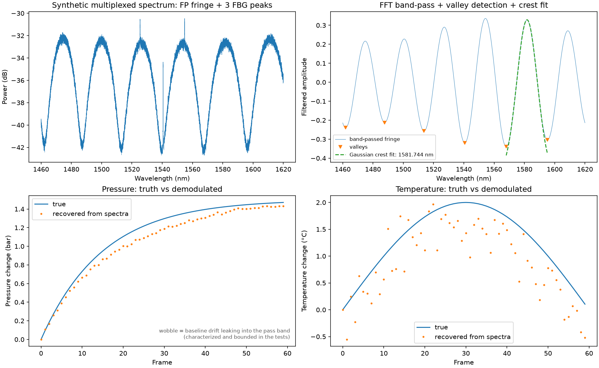

# fbg-fp-demod

Peak-tracking demodulation for Fabry-Perot and fibre Bragg grating (FBG)
sensors, on interferometric spectra. Python port of the MATLAB pipeline that
made it possible to measure pressure variation inside sealed commercial
battery cells ([Chem. Eng. J., 2024](https://doi.org/10.1016/j.cej.2024.156806)).

The method runs as post-processing over recorded spectra — that is how the
original instrumentation worked; nothing here is real-time. The demonstration
uses synthetic spectra generated by this repository's own code, with known
ground truth; no measured data is included.



## Run it

```bash
git clone <this-repo> && cd fbg-fp-demod
python3 -m venv .venv && source .venv/bin/activate
pip install -e '.[dev]'
python demo.py   # writes demo.png: truth vs demodulated P and T
pytest           # the same claims, asserted
```

Dependencies: numpy, scipy, matplotlib.

## How it works

A low-finesse Fabry-Perot cavity multiplexed with FBGs on one fibre. Per
spectrum: linearize dB power, isolate the FP fringe with an ideal band-pass
in spatial frequency (FFT mask), locate the fringe valleys, fit a
four-parameter Gaussian to the crest bracketing a tracked reference. Across
a sequence: the reference follows the tracked valley, and fringe hops at
the spectrum edges are unwrapped against the locally measured fringe
spacing. Pressure and temperature are separated with a 2x2 sensitivity
matrix (the FBG sees temperature; the FPI sees pressure with a temperature
cross-sensitivity).

| Module | Does |
|---|---|
| `fbgfp/synth.py` | synthetic FP + FBG spectra with noise, drift, and known truth |
| `fbgfp/peaks.py` | linearize, FFT band-pass, valley location |
| `fbgfp/fit.py` | Gaussian fits: sub-sample centres |
| `fbgfp/track.py` | tracking across a sequence, fringe-hop unwrap |
| `fbgfp/physics.py` | spectral shifts to pressure (bar) and temperature (°C) |
| `demo.py` | the full chain, truth vs recovered |

## Accuracy, as asserted by the tests

Measured on the synthetic benchmark (20 000-point spectra, 8 pm grid,
0.2 dB noise) and declared in the test suite, not just here:

- fringe-crest reading within tens of pm of the physical fringe maximum;
  noise jitter below 10 pm
- wavelength shifts recovered with a ~5% compression — a property of the
  original two-bin band-pass reconstruction, preserved by the port
- baseline drift leaking into the pass band causes a bounded systematic
  (~200 pm at 0.5 dB drift); characterized, not hidden
- end to end, pressure is recovered to under 0.1 bar RMS over a 1.5 bar
  transient, temperature to ~0.5 °C over 2 °C (FBG jitter divided by the
  10.2 pm/°C sensitivity is the floor)

Calibration sensitivities are library defaults and can be overridden per
sensor pair — see `fbgfp/physics.py`.

## License

MIT.
